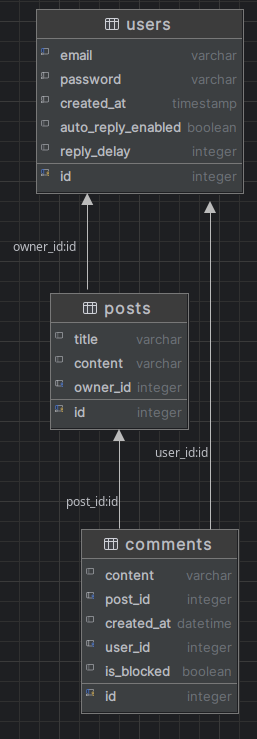

# StarNavi FastAPI

A simple API for managing posts and comments with AI moderation and automated replies. 
The API was developed using FastAPI and Pydantic. Perform basic social media actions.

## Table of Contents

- [Task](#task)
- [Installation](#installation)
- [Run with docker](#run-with-docker)
- [Getting access](#getting-access)
- [Technologies Used](#technologies-used)
- [Features](#features)
- [General Features](#general-features)
- [DB Structure](#db-structure)
- [An example of using the API](#an-example-of-using-the-api)

## Task

Нижче описано перелік функцій які повинні бути імплементовані:

- Реєстрація користувачів;

- Вхід користувачів;

- API для управління постами;

- API для управління коментарями;

- Перевірка поста чи коментарів в момент створення на наявність нецензурної лексики, образ тощо, та блокування таких постів чи коментарів.

- Аналітика щодо кількості коментарів, які були додані до постів за певний період. Приклад URL: /api/comments-daily-breakdown?date_from=2020-02-02&date_to=2022-02-15. API має повертати аналітику, агреговану по днях за кожен день, повинно повернутись кількість створених коментарів і кількість заблокованих.

- Функція автоматичної відповіді на коментарі якщо це увімкнув користувач для своїх постів. Автоматична відповідь повинна відбуватись не одразу, а через проміжок часу який налаштує користувач. Також відповідь повинна бути релевантна до поста та коментаря на який відбувається відповідь.

* Важливою умовою є те що мають бути написані тести до таких функцій як створення постів, та аналітика. Наявність тести для всіх функції буде плюсом.

- Покрити код тестами

## Installation

```bash
git clone https://github.com/AlexTsikhun/starnavi_fastapi
cd starnavi_fastapi
python3 -m venv .venv
source .venv/bin/activate
pip install -r requirements.txt
# set env variables
alembic revision --autogenerate -m "Init"
alembic upgrade head
python3 -m uvicorn main:app --reload
```

## Run with docker

Docker should be installed locally

```bash
docker compose build
docker compose up
```

## Getting access

- Create user via `api/v1/user/register/`
- Get access token `api/v1/user/token/`
- API Root `api/v1/posts/`

## Launch periodic task with Celery

Celery should be installed locally. Run worker and flower:

```bash
celery -A celery_app worker --loglevel=info

celery -A celery_app flower --port=5555
```

## Technologies Used

- FastAPI, Pydantic
- Celery, Redis
- Sqlite3
- Docker, docker compose
- Unittest

## Features:

- schedule Comment answer with Celery
- automatic Comment answer with Gemini API
- profanity checker with Gemini API
- JWT authenticated
- Documentation is located at `docs`
- Managing Posts and Comments
- Filtering followers, following
- Pagination for Posts

### General Features

User Registration and Authentication:

- Users can register with their email and password to create an account.

- Users can log in with their credentials and receive a token for authentication.

- Users can log out and invalidate their token.

Post Creation and Retrieval:

- Users can create new posts with text content 

Schedule Post creation using Celery:

- Added possibility to schedule Post creation (you can select the time to create the Post before creating of it).

API Permissions:

- Only authenticated users can perform actions such as creating/updating/deleting posts/comments.

API Documentation:

- The API is well-documented with clear instructions on how to use each endpoint.

- The documentation is included sample API requests and responses for different endpoints.

Technical Requirements:

- Used Django and Django REST framework to build the API.

- Used JWT authentication for user authentication.

- Used appropriate schemas for data validation and representation.

- Used appropriate URL routing for different API endpoints.

- Followed best practices for RESTful API design and documentation.

#### DB Structure:



### An example of using the API

A list of some of the main-simples endpoints (for more, use documentation):

Current user profile:


Another user profile view:


All post list:


Post detail:


My comment list:


<details style="border: 1px solid #ccc; padding: 10px; margin-bottom: 10px">
<summary style="font-size: 1.17em; font-weight: bold; ">Future work</summary>

- Add roles
- More validation
add change autoresponse
for vpn:
- username - vpnbook
- pass- b6xnvt9
- run vpn:
- sudo openvpn vpnbook-us16-tcp443.ovpn
</details>
